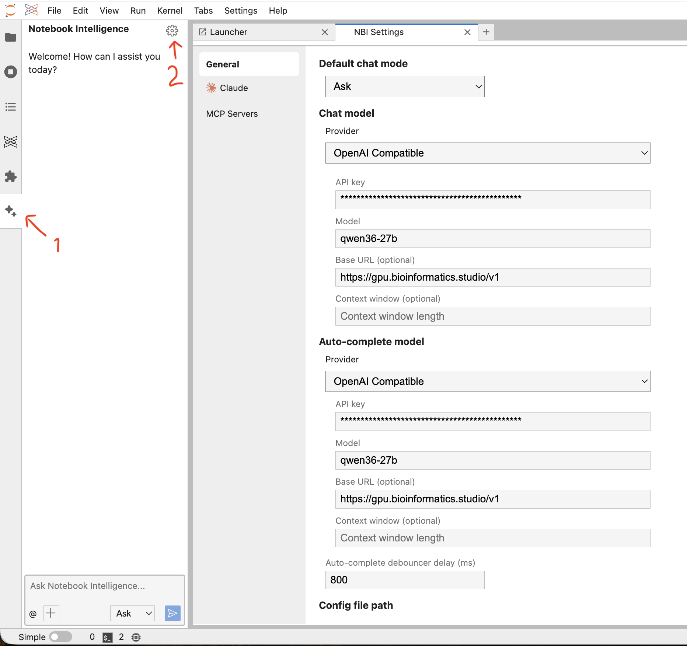
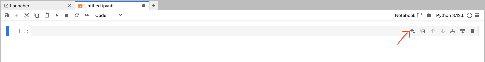
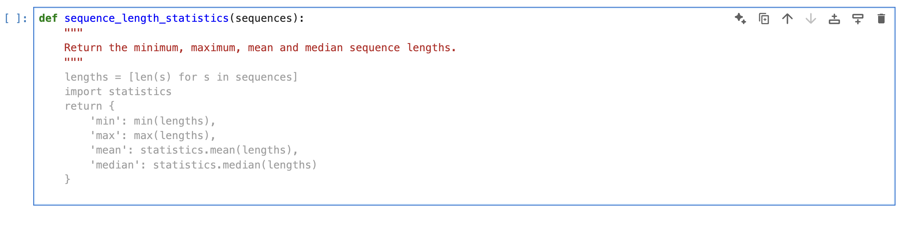
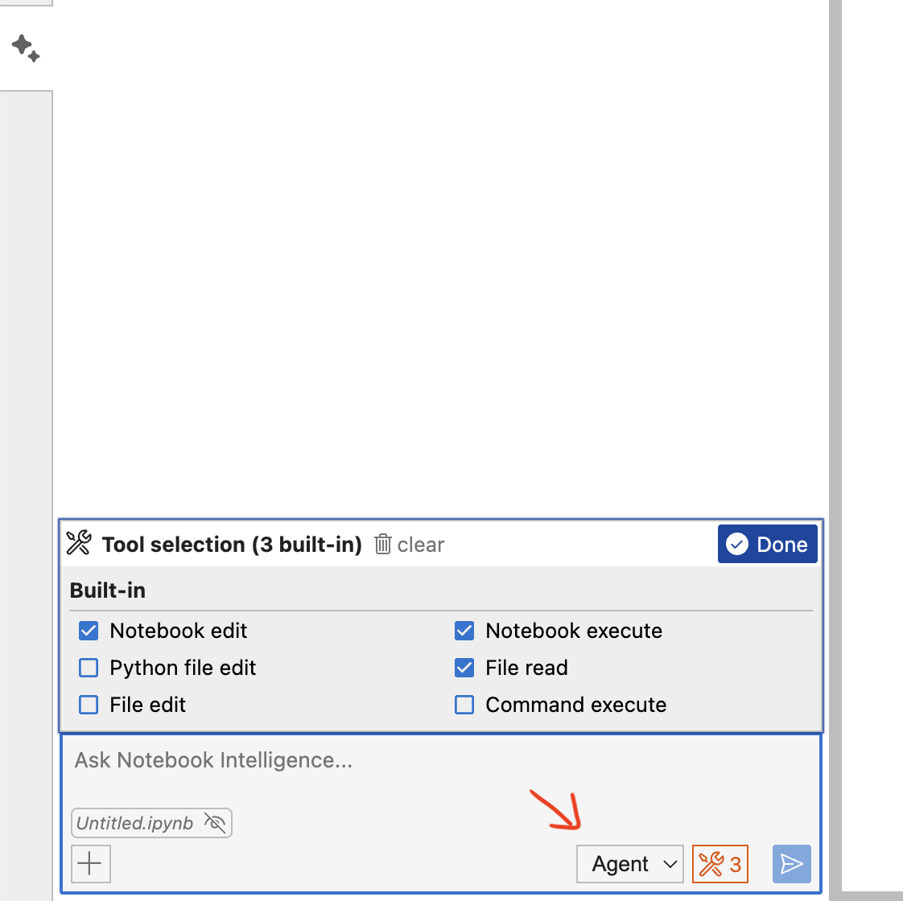

# Using the internal LLM in Posit JupyterLab

[Back to the MAGE-LLM user guides](README.md)

Posit JupyterLab includes **Notebook Intelligence (NBI)**, which connects to our internal LLM service. You can use it for:

- chat and questions in the side panel;
- code generation and editing inside notebook cells;
- automatic code completion; and
- agent-assisted notebook editing and execution.

Before starting, request a personal MAGE-LLM key as described in the [user-guide overview](README.md#request-a-mage-llm-key).

## 1. Configure Notebook Intelligence

1. Open JupyterLab in Posit.
2. Select the **Notebook Intelligence** sparkle icon in the left sidebar.
3. Select the **settings** gear in the Notebook Intelligence panel.
4. Configure both **Chat model** and **Auto-complete model** with the following values:

| Setting | Value |
|---|---|
| Provider | `OpenAI Compatible` |
| API key | Your personal MAGE-LLM key |
| Model | `qwen36-27b` |
| Base URL | `https://gpu.bioinformatics.studio/v1` |
| Auto-complete debouncer delay | `800` ms |



## 2. Ask questions in the side panel

Keep the mode set to **Ask** for explanations, code suggestions, troubleshooting, and questions about your analysis.

Add the relevant notebook or files as context when needed. Always review generated code before running it.

## 3. Generate or edit code inside a cell

Select the sparkle icon on the right side of a notebook cell, or press **Ctrl+G** on Windows/Linux or **Cmd+G** on macOS.

Describe the code you want, for example:

```text
Using pandas, read gene_counts.tsv, use the first column as the gene index,
and display the dimensions and first five rows.
```

Press **Ctrl+Enter** or **Cmd+Enter** to accept the generated code. Press **Esc** to close the suggestion without applying it.



## 4. Use automatic code completion

Start writing code and pause briefly. A suggested continuation appears as grey text.

- Press **Tab** or **Alt+End** to accept the suggestion.
- Press **Esc** to dismiss it.
- Press **Alt+\\** to request a suggestion manually.
- Use **Alt+[** and **Alt+]** to move between available suggestions.

Example:

```python
def sequence_length_statistics(sequences):
    """Return the minimum, maximum, mean and median sequence lengths."""

```

Leave the cursor on the indented blank line and wait for the suggestion.



## 5. Use Agent mode

Agent mode can read files, edit notebooks, execute notebook cells, and—when explicitly enabled—edit files or run terminal commands.

1. Change **Ask** to **Agent** in the side panel.
2. Select the tools icon.
3. Enable only the tools required for the task.
4. Describe the task and attach the relevant notebook or files.
5. Review proposed actions and confirmation requests carefully.

For ordinary notebook work, start with:

- **Notebook edit**
- **Notebook execute**
- **File read**

Enable **Python file edit**, **File edit**, or **Command execute** only when the task requires them. Before approving an action, verify the target file, directory, and command.



## Good practice

- Treat generated code as a draft: review it before execution.
- Start with read-only tools and enable editing or command execution only when necessary.
- Use project-relative paths and confirm output locations before writing files.
- Do not ask the assistant to delete or overwrite important data without checking the exact target.
- The models are hosted internally, but institutional and project data-handling rules still apply.

## Troubleshooting

### No autocomplete appears

- Confirm that the Notebook Intelligence provider is enabled under **Settings → Inline Completer**.
- Confirm the API key, model name, and Base URL.
- Place the cursor in a code cell, type part of a function, and press **Alt+\\**.
- Completely terminate and start a new Posit Jupyter session if Notebook Intelligence was recently updated.

### Chat works but Agent mode fails

- Confirm that **Agent** is selected and that the necessary tools are enabled.
- Start with a simple notebook task using **Notebook edit**, **Notebook execute**, and **File read**.
- If the problem persists, report the time of the failure, selected model, enabled tools, and visible error message to the service administrator.
